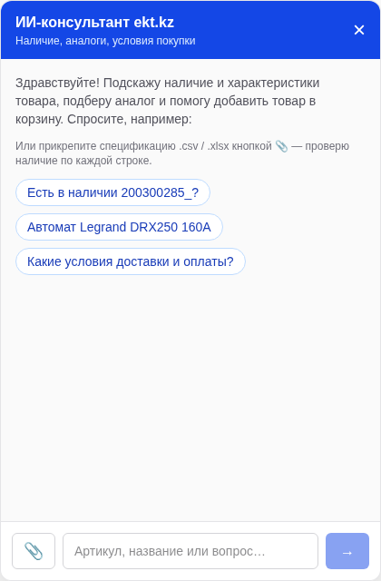
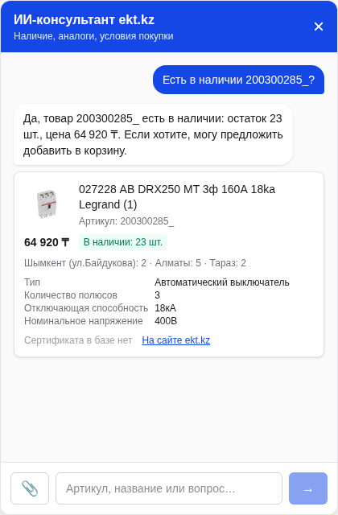
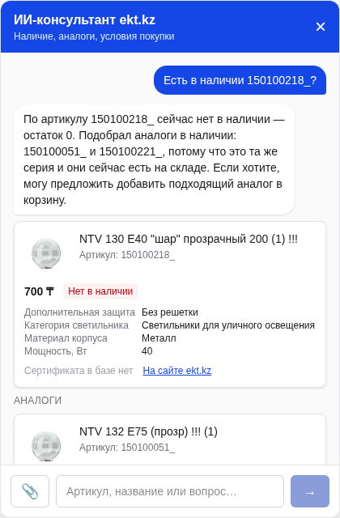
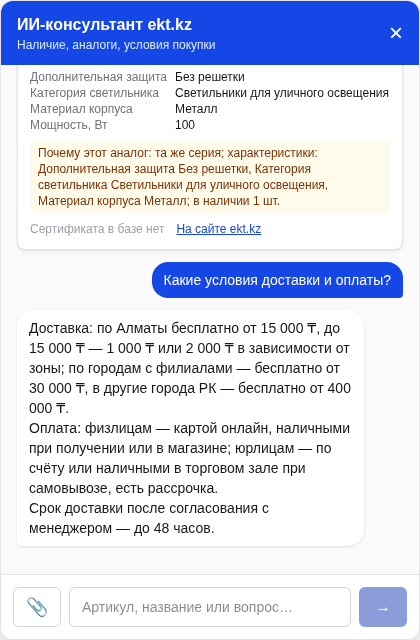
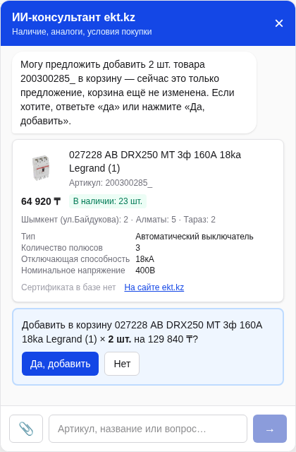

# Руководство пользователя — ИИ-консультант «Электрокомплект»

Руководство по поиску электротехнических товаров, подбору аналогов, загрузке спецификаций и подготовке корзины.

Дата подготовки: 23 сентября 2026 года.

> Иллюстрации взяты из готовых скриншотов репозитория `frontend/public/guide`. Это примеры интерфейса, а не результаты нового тестирования текущего запуска. Цены, остатки и условия на изображениях не следует считать актуальными.

## 1. Открытие приложения и чата

Для текущего локального запуска откройте [http://127.0.0.1:3002](http://127.0.0.1:3002). Адрес работает на компьютере, где запущен проект.

Нажмите **«Запустить ИИ-ассистента»** на главной странице или **«Консультант»** в правом нижнем углу. Откроется чат с примерами вопросов.

Введите сообщение в нижнее поле и нажмите кнопку со стрелкой. Также можно выбрать готовый вопрос. Крестик в шапке закрывает окно чата.

*Рисунок 1. Стартовый экран. Скрепка слева от поля ввода предназначена для загрузки спецификации.*

## 2. Поиск товара и проверка наличия

Введите артикул или название товара. Примеры:

- `Есть в наличии 200300285_?`
- `Автомат Legrand DRX250 160А`
- `Нужен диф автомат 16А 30мА`

При доступных данных появится ответ и карточка товара. Проверьте название, артикул, цену в тенге, остаток, склады и технические характеристики. Ссылка **«На сайте ekt.kz»** открывает страницу товара у партнёра.

*Рисунок 2. Пример карточки. Показанные цена и количество относятся к моменту создания исходного скриншота.*

Если сертификата нет, интерфейс сообщает об этом. Уточните сертификаты и недостающие характеристики у менеджера.

## 3. Подбор аналога

Если товар отсутствует, ассистент может предложить аналоги. Например, отправьте `Есть в наличии 150100218_?`.

Просмотрите блок **«Аналоги»** под исходной карточкой. Если карточки не помещаются, прокрутите сообщения внутри чата. У аналогов приводится объяснение совпадающих характеристик.

*Рисунок 3. Исходный товар отмечен как отсутствующий; ниже показаны альтернативы.*

Подбор носит рекомендательный характер. Перед покупкой сравните номинал, напряжение, число полюсов, размеры и другие необходимые параметры. Совпадение серии не гарантирует техническую взаимозаменяемость.

## 4. Доставка и оплата

Отправьте `Какие условия доставки и оплаты?` или уточните минимальную партию.

*Рисунок 4. Пример ответа об оплате и доставке из справочника проекта.*

Условия в приложении берутся из локального справочника. Перед оформлением уточните актуальные тарифы, сроки и доступные способы оплаты у магазина.

## 5. Добавление в корзину

1. Найдите нужный товар и проверьте его карточку.
2. Напишите `добавь 2 шт`.
3. Проверьте название, количество и сумму в предложении.
4. Нажмите **«Да, добавить»** для подтверждения или **«Нет»** для отказа. Короткий ответ `да` также подтверждает последнее открытое предложение.
5. После успешного добавления откройте **«Корзину»** в шапке чата и проверьте состав и итог.

*Рисунок 5. Ожидающее подтверждение. На этом этапе товар ещё не добавлен.*

Если запрошено больше доступного количества, предложение ограничивается остатком. Добавление в корзину не резервирует товар. Кнопка оформления открывает сайт ekt.kz; автоматический перенос позиций и оформление заказа в прототипе не реализованы.

## 6. Загрузка спецификации

Нажмите скрепку рядом с полем ввода и выберите файл. Можно начать с [примера спецификации](spec-example.csv), приложенного к руководству.

| Параметр | Поддержка |
|---|---|
| Форматы | `.csv`, `.xlsx`, `.docx` |
| Размер | До 2 МБ |
| Количество строк | До 50 |
| Колонки | «Артикул» / «Код», «Наименование», «Количество» |
| Обязательные данные | Хотя бы артикул/код или наименование |
| CSV | Разделитель `;` или `,`; UTF-8 или Windows-1251 |
| Excel | Читается первый лист |
| Word | Таблица с нужными колонками; также поддерживается текст с разделителями |

После обработки появится таблица позиций со статусами: в наличии, частично, нет или не найдено. При наличии подходящих данных отображаются аналоги и пояснения.

В режиме LLM после загрузки можно написать: `из файла добавь автомат на 250А — сколько есть`. Каждая позиция добавляется отдельно, с подтверждением. Добавление всей спецификации одним подтверждением не поддерживается.

Старый формат `.doc`, PDF и фотографии не поддерживаются. Для `.doc` сохраните документ как `.docx`.

> На стартовом скриншоте перечислены только CSV и XLSX. Текущая версия также поддерживает DOCX. Скриншота итоговой таблицы спецификации в исходном наборе нет.

## 7. Если что-то не работает

| Ситуация | Что сделать |
|---|---|
| Сайт не открывается | Убедитесь, что проект запущен, и проверьте адрес и порт. |
| Не удалось связаться с сервером | Повторите запрос после восстановления сервера. Если ошибка сохраняется, сообщите оператору. |
| Каталог временно недоступен | Попробуйте позже; оператор должен проверить доступ к API ekt.kz. |
| Товар не найден | Проверьте артикул или уточните название и характеристики. |
| Файл больше 2 МБ | Уменьшите размер или разделите спецификацию на несколько файлов. |
| Не удалось прочитать файл | Проверьте формат и колонки «Артикул» или «Наименование»; добавьте «Количество» при необходимости. |
| Товара уже нет в наличии | Повторно запросите карточку и выберите доступное количество или аналог. |

## 8. Ограничения и данные

- Для актуальных подробных карточек нужен доступ к партнёрскому API. Образец каталога не обеспечивает полноценное автономное демо.
- На момент подготовки руководства последняя синхронизация вернула `401 Unauthorized`: доступ к API партнёра требует настройки оператором. Наличие ключа OpenAI не предоставляет доступ к ekt.kz.
- При недоступности API приложение может использовать сохранённые карточки; данные могут быть устаревшими.
- История диалога хранится в памяти сервера и теряется после его перезапуска.
- Не отправляйте в чат пароли, API-ключи, платёжные или персональные данные. При включённой LLM содержимое диалога и результаты обработки спецификации могут передаваться внешней модели.

## 9. Справка для оператора

Подробная установка, синхронизация и настройка описаны в [README проекта](../../README.md). Доступы задаются в локальном `backend/.env`, который исключён из Git. Не размещайте реальные ключи в этом руководстве или скриншотах.

Состав папки:

- `README.md` — это руководство;
- `screenshots/` — пять иллюстраций из репозитория;
- `spec-example.csv` — пример файла для загрузки.
