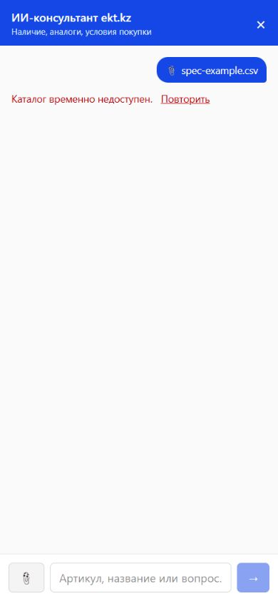
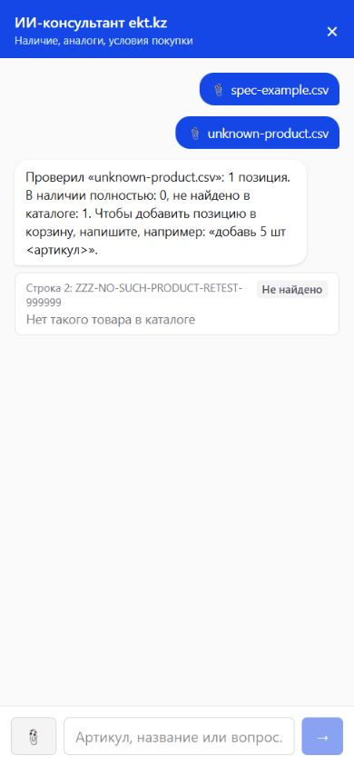
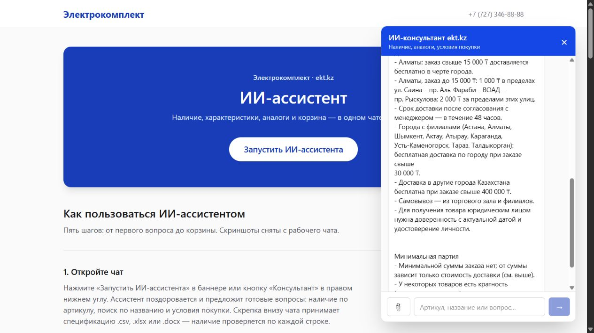
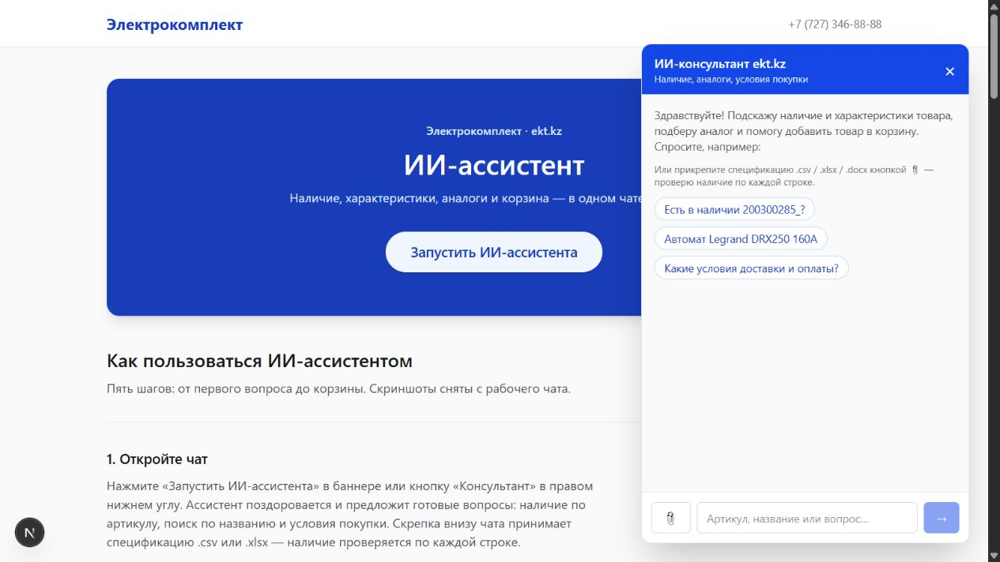
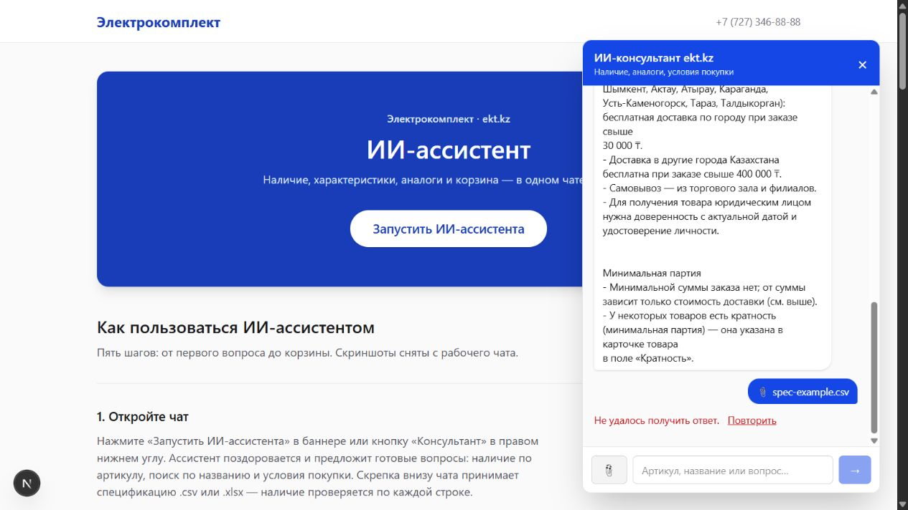
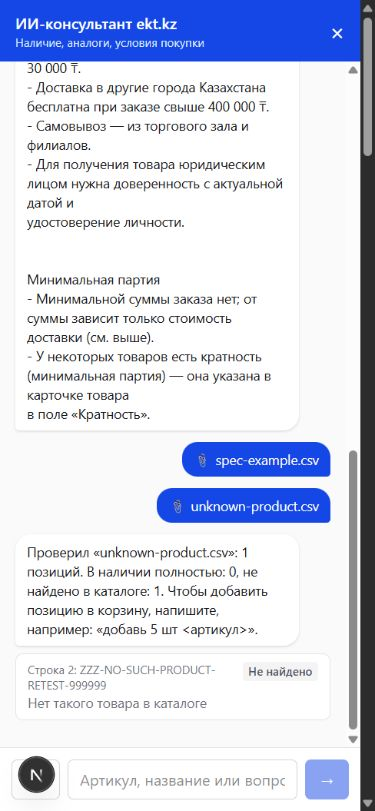

# Визуальная проверка и исправления — 23.09.2026, 17:25 UTC+05:00

## Последний прогон: исправления поверх b3e01f7

`git pull --ff-only` выполнен: удалённая ветка уже была актуальна (`b3e01f7`). Затем воспроизведены ошибки интерфейса, внесены исправления и проведена повторная проверка. Этот раздел описывает итоговую рабочую версию; разделы ниже сохранены как история и не заменяют текущие результаты.

### Что исправлено

| Проблема до исправления | Изменение | Подтверждение |
|---|---|---|
| Значок Next.js перекрывал скрепку на мобильном экране | Отключён плавающий dev-индикатор штатной настройкой Next.js; сообщения сборки и ошибок не отключены | На снимке 390×844 скрепка полностью видна, выбор файла работает |
| Фоновая страница прокручивалась за полноэкранным чатом | На мобильной ширине блокируется скролл html/body на время открытия чата; при закрытии блокировка снимается | Исчез внешний скроллбар; после закрытия computed overflow html/body снова `visible` |
| При 503 показывалось только «Не удалось получить ответ» | Состояние неудачного запроса сохраняет конкретное сообщение; ошибка показывается как alert с повтором | Загрузка README CSV показывает «Каталог временно недоступен.»; повтор делает новый запрос |
| Ошибка оставалась при выборе другого невалидного файла | Старое состояние ошибки очищается при начале нового выбора/загрузки | Реализовано в обработчике; успешная последующая загрузка также удаляет старый alert |
| Поиск при недоступности всех найденных карточек возвращал пустой список | Сервис сохраняет ошибки загрузки и возвращает 503, если ни одной карточки получить нельзя; доступные кэшированные карточки сохраняются | Регрессионные тесты и запрос `/api/catalog/search?q=Legrand` → 503 |
| Ошибка подбора аналогов могла потеряться при недоступности карточек | HTTP-маршрут аналогов преобразует недоступность каталога в 503 | Тест с закэшированным исходным товаром и недоступными аналогами прошёл |
| Поле ввода и стрелка не имели понятных доступных имён | Добавлены «Сообщение консультанту» и «Отправить сообщение» | Имена обнаружены в AX-дереве; отправка выполнена по этим именам |
| «1 позиций» в результате загрузки | Исправлено согласование: позиция/позиции/позиций | Через UI получено «Проверил …: 1 позиция» |
| Длинные имена файлов и артикулы могли выходить за границы | Добавлен перенос длинных непрерывных строк | Тестовый длинный артикул помещается в мобильной таблице |
| Инструкция пропускала DOCX и неточно указывала порог доставки | Добавлен DOCX; «от 15 000» заменено на «свыше 15 000» согласно локальному справочнику | Обновлённые тексты присутствуют на главной |

Обработка частично доступного каталога сохранена: при наличии кэшированной карточки она возвращается, даже если другие карточки недоступны. Пустой поиск без найденных кандидатов остаётся HTTP 200 с пустым списком. Изменение не подменяет реальные данные каталога и не создаёт фиктивные товары.

### Повторные проверки после исправлений

| Проверка | Итог |
|---|---|
| Backend pytest | **71 passed in 2.29s** |
| Новые регрессионные тесты | 5: поиск при сбое, неизвестный запрос при сбое, частичный ответ из кэша, сбой аналогов, сбой каталога в чате |
| Ruff check | All checks passed |
| Ruff format --check | 44 files already formatted |
| ESLint | 0 ошибок, 2 прежних предупреждения в конфигурационных файлах |
| TypeScript `tsc --noEmit` | Успешно |
| Next.js production build | Успешно, включая встроенную проверку TypeScript |
| Backend health / DB health / health через Next.js | Все три: HTTP 200, `{"status":"ok"}` |
| `git diff --check` | Ошибок пробелов нет |

При первом запуске форматирования после патча обнаружились смешанные переводы строк в четырёх Python-файлах. Ruff нормализовал их; итоговая проверка форматирования прошла. `make` в системе по-прежнему отсутствует: команды из `make check` выполнялись напрямую в локальном окружении, зависимости не менялись.

### Визуальные сценарии

1. **До исправления:** на мобильном снимке 390×844 значок Next.js закрывал скрепку, справа оставалась полоса фоновой страницы.
2. **Открыть чат после исправления:** панель занимает экран, поле и обе кнопки доступны, внешний скроллбар отсутствует.
3. **Загрузить `examples/spec-example.csv`:** backend возвращает 503 из-за отсутствия доступа к EKT; интерфейс показывает правильную причину и кнопку «Повторить».
4. **Повторить:** выполняется повторный upload; сообщение о недоступности сохраняется без добавления дубликата сообщения с именем файла.
5. **Выбрать `unknown-product.csv`:** успешная обработка одного заведомо неизвестного артикула, текст «1 позиция», таблица со статусом «Не найдено», предыдущая ошибка исчезает.
6. **Закрыть чат:** фоновая прокрутка восстановлена. Мобильный override сброшен.
7. **Открыть настольный чат и отправить вопрос об оплате, доставке и минимальной партии:** получены соответствующие разделы справочника. Панель работает после мобильного переключения.

Скриншоты итоговой версии:







### Ограничения и оставшиеся замечания

- EKT_API_USER/EKT_API_PASSWORD отсутствуют. Настоящие остатки, товарные карточки, аналоги и полный путь до заполненной корзины через UI не подтверждены; теперь недоступность отображается явно. Предпосылки товарного демо из README по-прежнему требуют синхронизации каталога и прогрева кэша.
- Проверка выполнена в режиме правил, с SQLite в памяти; реальная LLM и PostgreSQL в этом прогоне не проверялись. Приложение оставлено запущенным в таком режиме.
- Сохранение видимой истории после перезагрузки не добавлялось. Это прежнее ограничение прототипа, требующее отдельного решения по хранению истории.
- Случайное смешение языков в ответе LLM из старого отчёта не перепроверялось без LLM и не объявляется исправленным.
- Два предупреждения ESLint об анонимном default export в конфигурации остаются; на сборку они не влияют.
- Реальная мобильная экранная клавиатура и несколько браузеров не тестировались.

Обновлены локальный отчёт и репозиторный `docs/report.md`; скриншоты лежат рядом. API-ключи и другие секреты в изменения не добавлялись. Предыдущие результаты далее относятся к прежним версиям.

---

# Архив: повторная проверка по README — 23.09.2026

## Актуальный результат: коммит 326c6db

Выполнен `git pull --ff-only`: версия обновлена с `a12415c` до `326c6db`. Изменились 20 файлов: добавлены загрузка спецификаций CSV/XLSX/DOCX, тесты загрузки, баннер запуска ассистента, таблица результатов и инструкция на главной. Проверка проведена по разделам README «Установка и запуск» и «Как проверить решение», около 17:00–17:10 (UTC+05:00).

**Итог:** автоматические проверки и production-сборка прошли. Условия покупки, запуск чата из баннера и обработка CSV с неизвестным товаром работают. Полный сценарий с реальными товарами заблокирован отсутствием доступа к партнёрскому API EKT. Пример спецификации из README возвращает HTTP 503. Полностью готовым к демонстрации реального каталога приложение по этому прогону назвать нельзя.

### Окружение и отклонения от README

- Python 3.13.5, Node.js 24.19.0, Windows. README ориентируется на Node.js 22; точное окружение Docker в этом прогоне не воспроизводилось.
- Новые зависимости backend установлены в существующее локальное `backend/.venv` командой `pip install -e "backend[dev]"`.
- `make` и Docker в доступном PATH отсутствуют. `make check` повторно завершился ошибкой отсутствующей команды; эквивалентные проверки выполнены напрямую, их результаты ниже.
- Использована SQLite в памяти. Тест PostgreSQL/Docker не выполнялся.
- Backend перезапущен на актуальном коде с пустым `OPENAI_API_KEY`, как рекомендует README для воспроизводимого сценария режима правил. Предыдущий процесс с ключом остановлен. В этом прогоне OpenAI API не вызывался.
- Нет EKT_API_USER/EKT_API_PASSWORD: отсутствие доступа ранее подтверждено пользователем. `sync-catalog`, `warm-cache`, `make demo` не выполнены. Используется резервный каталог из 20 записей, который, согласно README, не обеспечивает автономное демо карточек.
- Frontend работает на порту 3000, backend на 8000. После проверки приложение оставлено запущенным в режиме правил; временный мобильный viewport сброшен.
- Во время тестирования исходный код не изменялся; `git status --short` был пустой. После завершения проверки этот отчёт и три скриншота добавлены в `docs/` по отдельному запросу пользователя. Проверенная версия приложения — `326c6db`; публикация отчёта не является новым тестовым прогоном.

### Автоматические проверки новой версии

| Проверка | Команда из соответствующей папки | Результат |
|---|---|---|
| Backend pytest | `.venv/Scripts/python.exe -m pytest -q` | **66 passed in 1.96s**, ранее было 52 |
| Ruff | `.venv/Scripts/python.exe -m ruff check .` | All checks passed |
| Форматирование Python | `.venv/Scripts/python.exe -m ruff format --check .` | 44 files already formatted |
| ESLint | `node node_modules/eslint/bin/eslint.js .` | 0 ошибок, 2 прежних предупреждения |
| TypeScript | `node node_modules/typescript/bin/tsc --noEmit` | Код выхода 0 |
| Production-сборка | `node node_modules/next/dist/bin/next build` | Код выхода 0, маршруты `/`, `/_not-found`, `/cart/[id]` |

Предупреждения ESLint: `import/no-anonymous-default-export` в `frontend/eslint.config.mjs:4` и `frontend/postcss.config.mjs:1`.

Новые 14 тестов загрузки покрывают статусы CSV, отсутствие изменения корзины при загрузке, Windows-1251, CSV с запятой, XLSX с заголовком документа, файл без заголовков, DOCX с таблицами и текстом, неподдерживаемый DOC/PDF, пустой файл, повреждённые XLSX/DOCX, превышение размера и передачу содержимого спецификации подставной LLM. Эти тесты используют фикстуры каталога и SQLite, а не живые EKT API и LLM.

### Health-проверки README

Все три запроса вернули HTTP 200 и `{"status":"ok"}`:

```text
http://127.0.0.1:8000/api/health
http://127.0.0.1:8000/api/health/db
http://127.0.0.1:3000/api/health
```

Это подтверждает доступность приложения, SQLite и прокси Next.js; не подтверждает PostgreSQL или партнёрский API.

### Сценарий для жюри: фактический проход

| Шаг README | Действие | Результат |
|---|---|---|
| Открытие | Нажата новая кнопка «Запустить ИИ-ассистента» | Чат открывается, показаны приветствие, подсказки и скрепка с доступным именем «Прикрепить файл» |
| 1 | `Есть в наличии 200300285_?` | «Не нашёл такой товар в каталоге…»; карточка/цена/остатки не получены |
| 2 | `Есть в наличии 150100218_?` | Такой же отрицательный результат; аналоги не проверены |
| 3 | `Какие условия доставки и оплаты? Минимальная партия?` | Показаны три раздела из локального справочника: оплата, доставка и минимальная партия |
| 4–5 | Выбор товара в наличии, предложение 2 шт., отказ, подтверждение, заполненная корзина | Заблокировано: нет доступной карточки товара. Соответствующие тесты на фикстурах прошли |
| 6 | Количество сверх остатка | Через UI не проверено по той же причине; автоматические тесты ограничений прошли |
| 7, загрузка | Через скрепку выбран `examples/spec-example.csv` | Запрос выполнен, backend вернул 503 `Catalog API unavailable`; UI показал «Не удалось получить ответ» и «Повторить» |
| 7, повтор | Нажата кнопка «Повторить» | Backend повторно получил upload-запрос и вернул 503; причина недоступности в UI не раскрывается |
| 7, LLM-продолжение | `из файла добавь автомат на 250А — сколько есть` | Не запускалось: загрузка примера не завершилась, режим этого прогона без LLM |

Отрицательные результаты шагов 1–2 в текущей среде не являются доказательством отсутствия товаров у партнёра. README требует сначала загрузить полный каталог и прогреть кэш; эти предпосылки не выполнены из-за отсутствия доступа.

### Дополнительная проверка загрузки без внешнего каталога

Создан отдельный тестовый файл `work/unknown-product.csv` с одной строкой и заведомо неизвестным артикулом `ZZZ-NO-SUCH-PRODUCT-RETEST-999999`, количеством 2. Он не заменяет пример README и не содержит настоящих товаров.

Файл загружен через настоящий диалог выбора файла в браузере. Получен ответ:

> Проверил «unknown-product.csv»: 1 позиций. В наличии полностью: 0, не найдено в каталоге: 1. Чтобы добавить позицию в корзину, напишите, например: «добавь 5 шт <артикул>».

В интерфейсе появилась строка 2 со статусом «Не найдено» и текстом «Нет такого товара в каталоге». Дополнительный независимый HTTP-проход подтвердил: `spec` содержит 1 строку со статусом `not_found`, корзина содержит 0 товаров, итог 0. Загрузка сама по себе не добавила позицию.

Таким образом, отправка файла, разбор CSV и отрисовка отрицательного результата работают. Статусы реальных товаров «В наличии», «Частично», «Нет в наличии» и реальные аналоги проверены только автоматическими тестами с фикстурами, а не через UI с EKT API.

### Визуальные наблюдения и скриншоты

В отличие от предыдущего прогона, захват экрана работает. Проверены настоящий интерфейс и скриншоты при настольном размере около 1280×720 и мобильном 390×844.

- Настольный экран: синий баннер, кнопка запуска, инструкция и панель чата читаемы. Панель открывается поверх правой части контента; поле ввода, скрепка и отправка находятся внутри панели.
- Мобильный экран: чат занимает доступную ширину; длинный артикул переносится, статус и текст строки остаются в пределах карточки. Горизонтального переполнения документа не обнаружено: измерены `innerWidth=390`, `scrollWidth=375` с учётом полосы прокрутки.
- В мобильном режиме видны одновременно полоса прокрутки чата и полоса фоновой страницы. Это замечание к блокировке фонового скролла при открытой панели.
- В режиме `next dev` значок Next.js в левом нижнем углу перекрывает область кнопки скрепки на мобильном экране. Это наблюдение относится к dev-режиму; production UI с таким значком не проверялся.
- Неизвестный товар отображается без карточки, с серым статусом «Не найдено»; никакой реальный положительный остаток не был визуально подтверждён.

Скриншоты текущего прогона:







Изображения в `frontend/public/guide/` — материалы самого репозитория, они не считаются доказательством успешного текущего прогона.

### Замечания по новой версии

1. **Средний приоритет: UI скрывает причину сбоя загрузки.** При 503 `Catalog API unavailable` отображается общее «Не удалось получить ответ». Следует сообщать о недоступности каталога и отличать её от неправильного файла и сбоя сети. Повтор отправки работает, но не устраняет отсутствие доступа.
2. **Низкий приоритет: согласование количества.** Для одной строки написано «1 позиций», а не «1 позиция». Наблюдалось в успешном ответе загрузки.
3. **Низкий приоритет: инструкция не полностью обновлена под DOCX.** На главной в первом шаге перечислены только CSV/XLSX; README и приветствие чата уже указывают CSV/XLSX/DOCX.
4. **Замечание мобильного UX:** двойная прокрутка и перекрытие скрепки значком Next.js в dev-режиме; перепроверить после блокировки скролла фона и на production-сервере.

Найденные замечания не исправлялись: задача этого прогона — повторное тестирование. Критических падений в автоматических проверках нет. Для полного сквозного подтверждения README нужны учётные данные EKT, синхронизированный каталог и прогретый кэш; затем повторить шаги 1–7, в том числе LLM-продолжение после успешной загрузки.

---

# Архив: предыдущая проверка версии 3436f24

Следующие результаты относятся к предыдущей версии. Указанное ниже ограничение захвата скриншотов устранено в новом прогоне выше; старые сведения о процессе с ключом также не описывают текущее состояние.

# Отчёт о проверке интерфейса и интеграции LLM

Дата: 23 сентября 2026 года. Проверка завершена около 16:50, UTC+05:00.

Проект: BAITC-Hacks/hack-f80b8ce9-skma. Проверенная локальная версия: `3436f24`, ветка `main`.

## Итог

Приложение запускается, основные действия чата доступны, запросы с подключённой LLM возвращают ответы. Однако полноценный сценарий «найти товар → проверить остаток → подтвердить добавление → открыть заполненную корзину» в текущем окружении не подтверждён: нет учётных данных партнёрского API EKT. Пользователь отдельно подтвердил их отсутствие.

Выявлена существенная ошибка обработки недоступности каталога: существующий в локальном списке товар показывается пользователю как «не найден», когда загрузка его карточки завершается ошибкой. Также обнаружены несовпадение примера поиска с демонстрационным каталогом, смешение языков в одном ответе LLM, отсутствие восстановления видимой истории после перезагрузки и замечания к доступности поля ввода/кнопки отправки.

**Ограничение визуальной проверки:** взаимодействие выполнялось в настоящем встроенном браузере через кнопки, поле ввода и клавиатуру. Состояния проверены по accessibility-дереву, DOM и геометрии элементов. Захват изображений неоднократно завершался ошибкой `Unable to capture screenshot`, включая альтернативный документированный метод и повтор после включения видимости браузера. Поэтому скриншотов нет; цвет, качество отрисовки, наложения и визуальную аккуратность на уровне пикселей нельзя считать проверенными. Эта работа является функциональной UI-проверкой с ограниченной проверкой компоновки, а не завершённым визуальным аудитом по изображениям.

## Окружение и безопасность данных

- Windows, Python 3.13, FastAPI backend, Next.js 16.3.6 frontend.
- Frontend: `http://127.0.0.1:3000/`, режим `next dev`.
- Backend: `http://127.0.0.1:8000/`, Uvicorn.
- База: SQLite в памяти. Содержимое корзин исчезнет после перезапуска backend.
- LLM: `gpt-5.4-mini`, endpoint `https://api.openai.com/v1`.
- Предоставленный пользователем ключ передан через окружение процесса backend. В файлы проекта, `.env`, отчёт или Git ключ не записывался. Временная обёртка запуска маскирует ключи в сообщениях логирования.
- Для товарного поиска использовался штатный резервный `backend/data/catalog_sample.json`: 20 записей. Полный каталог не синхронизирован. Тестовые карточки и успешные ответы партнёра искусственно не подставлялись.
- Размеры браузера: исходный 1280×720 и мобильный 390×844. В конце восстановлен исходный размер.
- Исходный код не изменялся, коммиты и push в рамках этой проверки не выполнялись. `git status --short` в конце пустой.

## Методика

1. Перезапущен backend с ключом и явным официальным адресом OpenAI API.
2. Открыт интерфейс; проверены открытие/закрытие чата, быстрый вопрос, ввод и отправка по Enter.
3. Отправлены вопросы об условиях, поиск по артикулу и названию, запрос добавления существующего в локальном каталоге товара.
4. Проверены мобильная компоновка, пустой ввод, повторное открытие и перезагрузка страницы.
5. Временно остановлен frontend для проверки сообщения об ошибке; затем сервер восстановлен.
6. Проверены отсутствующая корзина, повтор её загрузки и возврат на главную.
7. Дополнительными локальными HTTP-запросами проверены health, база и причины ошибки каталога. Прочитан соответствующий код обработки ошибок.

Успех HTTP 200 у `/api/chat` сам по себе не гарантирует работу LLM: приложение умеет переходить на резервные правила. Поэтому дополнительно проверены логи backend: в наблюдавшихся запросах сообщения `LLM failed, using rule-based answer` отсутствовали, ответы отличались от шаблонного вывода правил. Это подтверждает работу настроенного LLM-пути в проверенных сценариях. Отдельный трассировочный экспорт запросов OpenAI, request ID, расход токенов и стоимость не собирались.

## Таблица проверок

| ID | Проверка и шаги | Фактический результат | Статус |
|---|---|---|---|
| UI-01 | Открыть главную | Доступны заголовок, телефон, шесть категорий и кнопка «Консультант» | Пройдено по DOM/AX |
| UI-02 | Открыть чат | Есть заголовок, приветствие, три быстрых вопроса, ввод и закрытие | Пройдено |
| UI-03 | Нажать вопрос об оплате/доставке | Вопрос добавлен в историю, показано «Консультант печатает…», затем ответ | Пройдено с замечанием к языку |
| UI-04 | Ввести вопрос и нажать Enter | Вопрос отправляется; поле очищается; ответ появляется в диалоге | Пройдено |
| UI-05 | Пустой ввод и ввод из пробелов | Кнопка отправки отключена; для пробелов `isEnabled()` вернул `false` | Пройдено |
| UI-06 | Закрыть и снова открыть чат без перезагрузки | Предыдущие сообщения и черновик сохранены | Пройдено |
| UI-07 | Состояние ожидания | Отображается «Консультант печатает…»; кнопка отправки отключена | Пройдено |
| UI-08 | Проверить ограничение длины | У поля установлен `maxlength=2000`; фактическая вставка длинного текста не тестировалась | Частично |
| UI-09 | Мобильный размер 390×844 | Чат занимает экран, форма ввода находится внизу; ширина документа 390 | Пройдено по геометрии |
| UI-10 | Настольный размер 1280×720 | Панель чата 420×640 внутри экрана, ширина документа 1280 | Пройдено по геометрии |
| UI-11 | Остановить frontend и отправить вопрос | После ожидания показаны «Не удалось получить ответ» и «Повторить» | Обработка ошибки пройдена |
| UI-12 | Восстановить frontend после UI-11 | Новая вкладка работает; старая перешла на страницу сетевой ошибки браузера | Восстановление сайта пройдено; retry чата не подтверждён |
| UI-13 | Перезагрузить страницу и снова открыть чат | Вместо истории показаны приветствие и быстрые вопросы | Замечание UX |
| UI-14 | Открыть `/cart/visual-test-nonexistent` | «Корзина не найдена. Возможно, ссылка устарела.»; кнопки «Повторить» и «На главную» | Пройдено |
| UI-15 | Нажать «Повторить» для отсутствующей корзины | Выполнен новый запрос, снова корректное сообщение 404 | Пройдено |
| UI-16 | Нажать «На главную» из корзины | Открыта главная страница | Пройдено |
| LLM-01 | Общие условия доставки и оплаты | Получен содержательный ответ, но в конце встречается слово «Եթե» | Ответ получен; дефект качества |
| LLM-02 | Доставка по Алматы при сумме 10 000 ₸ | Указаны 1 000 ₸ внутри заданных улиц и 2 000 ₸ за их пределами | Пройдено для суммы 10 000 ₸ |
| CAT-01 | `Есть в наличии 200300285_?` | «Товар не найден»; этого артикула нет в резервных 20 записях | Демо-сценарий не работает |
| CAT-02 | `Найди автомат Legrand DRX250 160А` | «Товар не найден»; карточки не показаны | Успешный поиск не подтверждён |
| CAT-03 | Наличие и добавление 2 шт. `310100080_` | «Товар не найден», хотя артикул есть в локальном списке; API карточки отдаёт 503 | Ошибка обработки сбоя |
| CART-01 | Реальные товарные карточки, остатки, аналоги, подтверждение добавления | Нет доступа к EKT API; карточки не получены | Заблокировано окружением |
| VIS-01 | Скриншоты главной/чата/мобильного состояния | Инструмент захвата не возвращает изображение | Заблокировано инструментом |

## Зафиксированные ответы

### Общие условия

Вопрос: «Какие условия доставки и оплаты?»

Ответ интерфейса:

> Оплата: картой онлайн, наличными при получении или самовывозе; для юрлиц — перечислением на счёт, при самовывозе также наличными или через POS-терминал. Доставка по Алматы бесплатна при заказе свыше 15 000 ₸, срок — после согласования с менеджером в течение 48 часов; в другие города и по филиалам условия зависят от суммы заказа. Եթե хотите, могу кратко написать условия именно для Алматы или для вашего города.

Ответ в основном соответствует локальному `backend/data/terms.md`; слово «Եթե» нарушает единый русский язык ответа. Проверка не подтверждает актуальность коммерческих условий на стороне партнёра.

### Конкретная сумма доставки

Вопрос: «Сколько стоит доставка по Алматы при заказе на 10000 тенге?»

Ответ интерфейса:

> При заказе на 10 000 ₸ по Алматы доставка платная: 1 000 ₸ в пределах ул. Саина – пр. Аль-Фараби – ВОАД – пр. Рыскулова, либо 2 000 ₸ за пределами этих улиц. Бесплатная доставка по Алматы — только от 15 000 ₸.

Стоимость для 10 000 ₸ совпадает с локальным источником. Есть неточность формулировки порога: источник говорит «свыше 15 000», ответ — «от 15 000». Граничный заказ ровно на 15 000 ₸ отдельно не тестировался; условие стоит формализовать, чтобы исключить двусмысленность.

### Существующий артикул и корзина

Вопрос: «Проверь наличие 310100080_ и добавь 2 штуки в корзину, если товар доступен.»

Ответ интерфейса:

> По артикулу 310100080_ товар не найден, поэтому проверить наличие и предложить добавление в корзину не могу. Если есть название или код производителя, пришлите — поищу.

Товар присутствует в `catalog_sample.json`: ID 25397, артикул `310100080_`, «007886 Диф.авт. 1p+N 16А (30мА) 411002 Legrand (1)!!!». Сообщение об отсутствии товара вводит пользователя в заблуждение: подтверждена недоступность карточки, а не отсутствие позиции.

## Обнаруженные проблемы и рекомендации

### F-01. Сбой каталога маскируется под отсутствие товара — высокий приоритет

Воспроизведение: запустить приложение без доступа к EKT API; запросить `310100080_`; сравнить ответ чата с прямым запросом `/api/catalog/25397`.

Факты: карточка возвращает 503, поиск `/api/catalog/search?q=310100080_` возвращает 200 и `[]`, чат сообщает «товар не найден». В `backend/app/services/catalog_service.py`, строки 318–332, `get_products()` перехватывает `CatalogUnavailableError`, заменяет результат на `None` и удаляет его из списка.

Рекомендация: различать пустую выдачу, частично доступные карточки и полную недоступность внешнего каталога. Передавать LLM и интерфейсу признак сбоя, сообщать «Не удалось проверить наличие», предлагать повтор, не утверждать отсутствие товара.

### F-02. Быстрый вопрос не соответствует резервному каталогу — средний приоритет

В `frontend/app/_components/chat-widget.tsx:15` предлагается артикул `200300285_`. В штатном резервном списке из 20 товаров его нет. Первый демонстрационный сценарий приводит к отрицательному результату ещё до проверки остатков.

Рекомендация: выбирать подсказки из загруженного каталога или включить соответствующие позиции в демонстрационный набор. Без EKT-доступа также нужны явно обозначенные демонстрационные карточки, иначе одна смена артикула не исправит загрузку остатков.

### F-03. Смешение языков в ответе LLM — средний приоритет

В русском ответе появилось «Եթե». Это единичное наблюдение, а не доказательство систематической ошибки.

Рекомендация: явно закрепить язык ответа и добавить проверку качества ответов на русском. Повторить сценарий несколько раз после изменения инструкций модели.

### F-04. Видимая история исчезает после перезагрузки — средний приоритет UX

Закрытие/открытие панели сохраняет историю, но перезагрузка страницы её очищает. В исходном коде сообщения хранятся только в React state (`chat-widget.tsx:56`), а идентификаторы сессии/корзины — в localStorage. Из-за этого видимая переписка может расходиться с сохранённым серверным контекстом.

Рекомендация: восстанавливать историю по session ID либо явно начинать новую сессию вместе с очисткой истории. Если отсутствие восстановления задумано для прототипа, обозначить это в интерфейсе.

### F-05. Недостаточно понятные имена элементов ввода — средний приоритет доступности

В accessibility-дереве поле представлено без явного названия; у него есть placeholder, но нет отдельного label/aria-label. Кнопка отправки имеет только текст «→», без понятного названия «Отправить сообщение». Кнопка закрытия, напротив, имеет имя «Закрыть чат».

Рекомендация: добавить явное доступное имя поля и кнопки. Это замечание подтверждено DOM/AX, но полноценное тестирование экранным диктором не проводилось.

### F-06. Неоднозначный порог бесплатной доставки — низкий приоритет содержания

Локальные условия используют «свыше 15 000 ₸», один ответ модели — «от 15 000 ₸». Для заказа 10 000 ₸ результат верен; граничное значение требует отдельного теста и уточнения у партнёра.

## Геометрия интерфейса

Измерения получены из `getBoundingClientRect()` и размеров DOM, без изображений.

| Режим | Элемент | Координаты и размер |
|---|---|---|
| 1280×720 | Чат | x=836, y=56, ширина 420, высота 640 |
| 1280×720 | Поле ввода | x≈848.8, y≈643.2, ширина≈340.6, высота 40 |
| 1280×720 | Кнопка отправки | x≈1197.4, y≈643.2, ширина≈45.8, высота 40 |
| 390×844 | Чат | x=0, y=0, ширина≈390.4, высота 844 |
| 390×844 | Форма ввода | x=0, y≈777.6, высота≈66.4 |
| 390×844 | Поле ввода | x=12, y≈790.4, ширина≈312.6, высота≈41.6 |

Ширина документа совпадает с viewport: 1280 и 390 соответственно. Горизонтального переполнения на проверенных состояниях не обнаружено. Мобильная экранная клавиатура, ориентация landscape, увеличение системного шрифта и реальный телефон не проверялись.

## Диагностические HTTP-проверки

```text
GET /api/health                              200 {"status":"ok"}
GET /api/health/db                           200 {"status":"ok"}
GET /api/catalog/25397                       503 {"detail":"Catalog API unavailable"}
GET /api/catalog/515291                      503 {"detail":"Catalog API unavailable"}
GET /api/catalog/search?q=310100080_          200 []
GET /api/cart/visual-test-nonexistent         404
GET http://127.0.0.1:3000/api/health          200 {"status":"ok"}
```

До искусственного отключения frontend запрос журнала предупреждений/ошибок браузера вернул пустой список. Это ограниченный снимок журнала, а не утверждение об отсутствии ошибок за весь сеанс. Ошибки сети во время намеренного отключения ожидаемы и не учитываются как самостоятельный дефект приложения.

## Ранее выполненные автоматические проверки этой версии

Эти результаты получены на предыдущем этапе той же задачи, до включения реального ключа. В текущем UI-сеансе повторно весь набор не запускался: исходный код не менялся.

| Проверка | Результат |
|---|---|
| pytest | 52 passed, 2.03 секунды |
| Ruff check | All checks passed |
| Ruff format --check | 42 файла уже отформатированы |
| ESLint | 0 ошибок, 2 предупреждения `import/no-anonymous-default-export` |
| TypeScript `tsc --noEmit` | Успешно |
| Next.js production build | Успешно; маршруты `/`, `/_not-found`, `/cart/[id]` |

Предупреждения ESLint находятся в `frontend/eslint.config.mjs` и `frontend/postcss.config.mjs`. `make` в Windows отсутствует; команды проверок выполнялись напрямую. Автотесты используют SQLite и подставные ответы каталога/LLM: их успех не подтверждает доступность реальных EKT API или PostgreSQL.

## Что осталось непроверенным

- Скриншоты и полноценная оценка визуального оформления: ошибка инструмента захвата.
- Реальные карточки товаров, изображения, актуальные цены и остатки: нет EKT credentials.
- Аналоги, подтверждение/отмена добавления, изменение количества, итог заполненной корзины через UI: зависят от доступного каталога.
- Успешный повтор отправки в чате после сетевого сбоя: интерфейс ошибки наблюдался, но старая вкладка после отключения сервера перешла на сетевую страницу браузера. Повтор загрузки отсутствующей корзины проверен отдельно.
- PostgreSQL, Docker, миграции, параллельные пользователи и нагрузка.
- Поведение при ошибке/исчерпании квоты OpenAI, утечки данных, полноценный security-аудит.
- Стоимость вызовов и токены: не измерялись.

## Состояние после проверки

Frontend и backend оставлены запущенными. Главная страница открыта в браузере, исходный размер viewport восстановлен. Backend использует указанный ключ только в текущем процессе и SQLite в памяти. Последняя проверка health через frontend успешна.

Для следующего этапа нужны доступ к EKT API или согласованный демонстрационный режим, исправление F-01 и рабочий захват скриншотов. После этого следует повторить полный путь от поиска до заполненной корзины и отдельно проверить границу бесплатной доставки.
